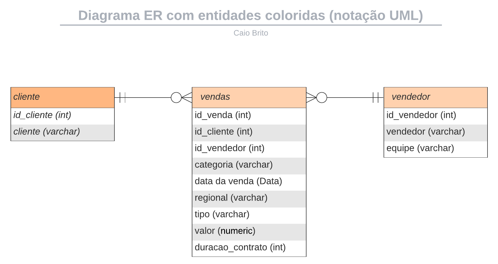

# Configurando o Ambiente

## Configurando o Python

Foram utilizados o **Visual Studio Code** para a implementação de todo o projeto e o sistema operacional **Linux Ubuntu versão 22.04**.

Recomendo a utilização de um ambiente virtual para a compilação do projeto, evitando possíveis erros, dependendo da instalação atual do Python na máquina que compila o projeto. Para configurar um ambiente virtual no VS Code:

1. Instale a extensão **Python - Microsoft** no VS Code. As extensões podem ser acessadas com `Ctrl + Shift + X`.
2. Com a pasta do projeto aberta, execute `Ctrl + Shift + P` para abrir a **Paleta de Comandos**, ou acesse **Ver -> Paleta de Comandos**. Escreva **Python** e selecione **Python: Create Environment**.
3. Para instalar todas as bibliotecas e extensões do Python necessárias no projeto, execute no terminal:
   ```bash
   pip install -r requirements.txt
   ```
4. Feche o terminal e abra um novo para aplicar as alterações, caso não tenha ocorrido automaticamente.

---

## Modelo de relacionamento utilizado no banco de dados



---

## Configurando o PostgreSQL

Na configuração do PostgreSQL, foram seguidas as etapas abaixo:  

### Instalando o PostgreSQL
Para instalar o PostgreSQL no Ubuntu pelo terminal foi utilizada a versão "Included in Distribution" do página oficial. Execute o seguinte comando no terminal para instalá-lo:

```bash
sudo apt install postgresql
```  

### Instalando o pgAdmin
Foram instaladas as versões **desktop** e **web** do pgAdmin4, mas apenas a **desktop** foi utilizada. Para instalar, siga a sequência de comandos abaixo, retiradas do site oficial: https://www.pgadmin.org/download/pgadmin-4-apt/.

```
#
# Setup the repository
#

# Install the public key for the repository (if not done previously):
curl -fsS https://www.pgadmin.org/static/packages_pgadmin_org.pub | sudo gpg --dearmor -o /usr/share/keyrings/packages-pgadmin-org.gpg

# Create the repository configuration file:
sudo sh -c 'echo "deb [signed-by=/usr/share/keyrings/packages-pgadmin-org.gpg] https://ftp.postgresql.org/pub/pgadmin/pgadmin4/apt/$(lsb_release -cs) pgadmin4 main" > /etc/apt/sources.list.d/pgadmin4.list && apt update'

#
# Install pgAdmin
#

# Install for both desktop and web modes:
sudo apt install pgadmin4

# Install for desktop mode only:
sudo apt install pgadmin4-desktop

# Install for web mode only: 
sudo apt install pgadmin4-web 

# Configure the webserver, if you installed pgadmin4-web:
sudo /usr/pgadmin4/bin/setup-web.sh
```

**OBS:**  
Se ocorrerem problemas ao excluir servidores antigos no pgAdmin4, caso existam, siga este link para solução:  
https://stackoverflow.com/questions/75658605/error-dropping-removing-server-group-test-in-pgadmin.

---

## Criando o Servidor

Agora iniciaremos a criação do servidor e do banco de dados que serão utilizados na execução do projeto.

### Registrando o Servidor
1. Abra o aplicativo **pgAdmin4**.
2. Registre um novo servidor com as seguintes configurações:
   - **Name:** db_teste
   - **Host name/address:** 127.0.0.1
   - **Port:** 5432
   - **Username:** postgres
   - **Password:** postgres

Se ocorrer erro de senha execute os seguintes comandos no terminal para redefinir a senha do usuário `postgres`:
```bash
sudo -i -u postgres
\password postgres
```
Defina a nova senha como `postgres` e confirme. Agora será possível concluir a criação do servidor com o usuário e senha postgres.

### Criando o Banco de Dados

Crie um banco de dados chamado `vendas` no servidor registrado. Esse banco será usado para armazenar as informações dos vendedores, clientes e vendas do CSV fornecido.

---

## Compilando o Projeto

Para compilar o projeto:

1. Execute o arquivo `main.py`. Utilize o botão de **play** no canto superior direito do VS Code.
2. Caso o projeto tenha sido corretamente compilado, você verá a seguinte mensagem no terminal:
   ```
   Dados da tabela cliente inseridos com sucesso!
   Dados da tabela vendedor inseridos com sucesso!
   Dados da tabela vendas inseridos com sucesso!
   ```

Em seguida, uma aba com o **dashboard em Streamlit** será aberta, exibindo gráficos com informações relevantes da base de dados.

---

## Resultados das Questões

Para facilitar a visualização e reutilização do código, arquivos `.txt` foram gerados contendo os resultados das questões do PDF de recrutamento. O nome de cada arquivo corresponde à sua respectiva questão.